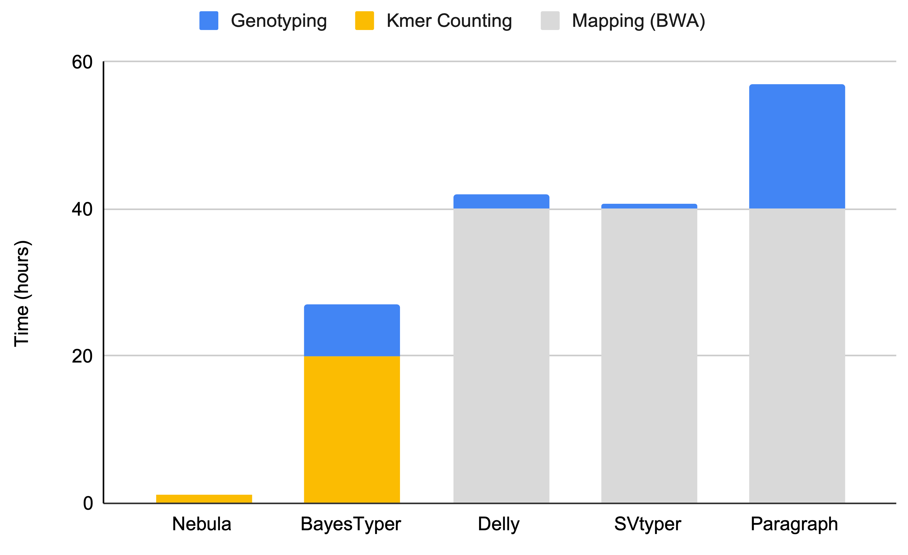

# Nebula

Nebula is an ultra-efficient mapping-free structural variation genotyper based on kmer counting.

# Operating Principles

Nebula is a mapping-free approach for accurate and efficient genotyping of SVs. Nebula is a two-stage approach and consists of a **kmer extraction phase** and a **genotyping phase**. Given as input a set of SV coordinates (BED/VCF), the  reference assembly (FASTA), and a set of mapped samples on which the genotype of these SVs is already known, Nebula extracts a collection of kmers that represent the input SVs (kmer extraction phase) and these extracted kmers will then be used to genotype the same set of SVs on any new WGS sample(s) without the need to map the reads to the reference genome (genotyping phase). This is done by counting the kmers in the WGS reads of the new sample(s) and predicting genotypes using a likelihood model. 


# Installation

Nebula's only dependency is htslib which is included as submodule for compatibility reasons. Clone recursively:

```
git clone --recursive git@github.com:Parsoa/Nebula.git
cd Nebula
```

Then build htslib:

```
cd src/cpp/htslib
make
```

Then build Nebula itself:

```
cd ..
make
```

You need to update your `LD_LIBRARY_PATH` to use Nebula's own htslib instance:

```
export LD_LIBRARY_PATH=$LD_LIBRARY_PATH:/path/to/Nebula/src/cpp/htslib
```

# Usage

## kmer Extraction 

Nebula requires a reference genome in FASTA format and a number of samples in BAM/SAM/CRAM format along with SV genotypes for each sample in BED format. Only the following basic fields are required in the BED file:

```
#CHROM BEGIN   END SVTYPE SEQ
```

To use the reference genome for extraction, the SV type should be one of `DEL`, `INS` or `INV`. For other types of SVs, kmers will only be extracted from mapped reads. The `SEQ` field is only used for insertions and should contain the inserted sequence.

Same set of SVs should be passed for all samples being preprocessed. If the set of SVs is not the same, then the union of all SVs found in the BED files will be considered and SVs that don't have a genotype for a sample are assumed to be 0/0 on that sample.

Nebula keeps all files and folders produced during a preprocessing run under the same directory. This is initially determined by passing `--workdir`. This directory will be created if it doesn't already exist. For the sake of these examples, we will initially set `workdir` to `/output`.

To extract kmers run the `preprocess` command. This will output the extracted kmers in a series of JSON files under `/output`. This command process multiple pairs of BAM and BED files at the same time. List arguments are separated by comma.

```
nebula preprocess --bed /path/to/genotypes_1.bed,/path/to/genotypes_2.bed --bam /path/to/bam_file_1.bed /path/to/bam_file_2.bed --wokdir /output --reference /path/to/reference/FASTA/file --thread <number of threads to use>
```

Next, the input samples should be genotyped with these kmers. The genotyping output for each of the samples must be stored in a subdirectory inside `output` specified by passing `--workdir`.`--bed` is the corresponding set of SV calls for the current sample. `--kmers` specifices the location of extracted kmers. The `gc_kmers` and `depth_kmers` arguments take a precaculated list of kmers used for estimating sequencing depth across regions of the genome with different levels of GC content. These files can be downloaded from [here](https://github.com/Parsoa/Nebula/tree/master/experiments/kmers).

Note that we are passing `--select` here. This tells the genotyper to only keep kmers that predict the known genotypes correctly. This flag must be passed during preprocessing.
Passing `--unique` causes the genotyper to only keep kmers unique to one SV. This option will usually result in higher precision during genotyping but may reduce recall slightly.

```
nebula genotype --bed /path_to_genotypes_1.bed --bam /path/to/bam_file_1.bed --workdir output/sample_1 --kmers /output --depth_kmers depth_kmers.json --gc_kmers gc_kmers.json --select --unique
nebula genotype --bed /path_to_genotypes_2.bed --bam /path/to/bam_file_2.bed --workdir output/sample_2 --kmers /output --depth_kmers depth_kmers.json --gc_kmers gc_kmers.json --select --unique
```

Finally, merge the remaining kmers after filtering by running the `mix` subcommand. The `--samples` argument takes the name of input sample. This is basically the name of the directories passed during the previous stage when running the genotyper.

```
nebula mix --bed /path_to_genotypes_1.bed,/path_to_genotypes_2.bed --samples sample_1,sample_2 --workdir /output
```

The output kmers are stored in a folder named `Mix` inside workdir (here `/output/Mix`).

## Genotyping

For genotyping unmapped sample with the extracted kmers from an earlier kmer-extraction run:

```
nebula genotype --kmers /path/to/Mix/directory --bam/--fastq /path/to/sample --workdir <output directory>
```

This will count the kmers on the new sample and calculate genotypes. Note that we don't pass `--select` here.

Nebula will output a BED file named `genotypes.bed` in the specified working directory. The file will include the original fields in the input BED files along with the field `GENOTYPE` (one of 0/0, 1/0 or 1/1). Note that a BED file does not need to passed to the genotyper; the variants are implicit in the kmers. There are no requirements on the output directory.

# Benchmarking and Performance

Nebula is designed to be simple, fast and memory efficient so it can be run on any reasonable personal hardware. Using a single processor core, Nebula can count kmers at a rate of 400,000 reads per second from a FASTQ file. A 30x human sample can be process in less than 80 minutes on a single core.

Nebula's kmer counter is very fast, as a result genotyping runtime is mostly a function of memory bandwidth and I/O speed when reading sequencing data from disk. Unless you have very fast disk I/O, it's unlikely that adding more threads will improve kmer counting runtime. The initial loading of kmers and the final step of genotyping SVs using the likelihood model will benefit significantly from multiple threads, however they account for only 15% of the runtime.
The kmer extraction step will benefit largely from multiple threads as its most time-consuming component, finding occurrences of kmers in the reference genome, can be parallelized over differnet chromosomes.

Nebula is an order of magnitude faster than other tools when genotyping an unmapped sample in FASTQ sample. The figure below shows comparison of Nebula's runtime against several other state-of-the-art methods.



# Citation

Nebula was originally presented in Recomb-Seq 2019, the pre-print for that version can be found below:

https://doi.org/10.1101/566620

The current version of Nebula is substantially different from what was presented in 2019. Nebula was published on Oxford Nucleic Acid Research In Jan 2021:

https://doi.org/10.1093/nar/gkab025
