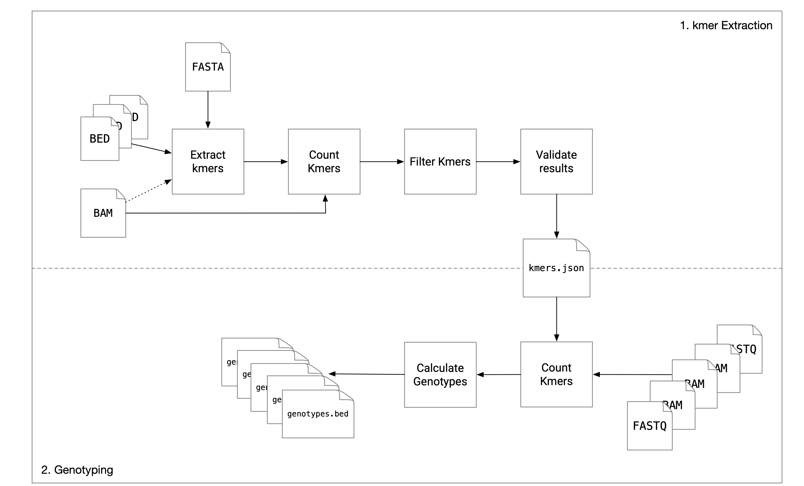

# Nebula

Nebula is an ultra-efficient mapping-free structural variation genotyper based on kmer counting.

# Operating Principles

Nebula is a mapping-free approach for accurate and efficient genotyping of SVs. Nebula is a two-stage approach and consists of a **kmer extraction phase** and a **genotyping phase**. Given as input a set of SV coordinates (BED/VCF), the  reference assembly (FASTA), and a set of mapped samples on which the genotype of these SVs is already known, Nebula extracts a collection of kmers that represent the input SVs (kmer extraction phase) and these extracted kmers will then be used to genotype the same set of SVs on any new WGS sample(s) without the need to map the reads to the reference genome (genotyping phase). This is done by counting the kmers in the WGS reads of the new sample(s) and predicting genotypes using a likelihood model. 



# Installation

Nebula's only dependency is htslib; the headers are included in this repository for convenience. Clone this repository recursively and build:

```
git clone --recursive git@github.com:Parsoa/Nebula.git
make
```

If your htslib shared object (`libhts.a`) is in a non-standard directory you can pass it to `make` using the `HTSLIB` option :

```
HTSLIB=/software/htslib/1.8/lssc0-linux/lib/libhts.a
```

```

# Usage

## kmer Extraction 

Nebula requires a reference genome in FASTA format and a number of samples in BAM/SAM/CRAM format along with SV genotypes for each sample in BED format. Only the following basic fields are required in the BED file:

```
#CHROM BEGIN   END SVTYPE SEQ
```

To use the reference genome for extraction, the SV type should be one of `DEL`, `INS` or `INV`. For other types of SVs, kmers will only be extracted from mapped reads. The `SEQ` field is only used for insertions and should contain the inserted sequence.

The union of all SVs found in the BED files will be considered. SVs are identified only by coordinates. SVs that don't have a genotype for a sample are assumed to be 0/0 on that sample. Ideally the same set of SVs should be passed for all samples.

Nebula expects a certain directory structure for outputs of different stages. For a kmer-extraction run, create an output directory that will contain all resulting and intermediate files, e.g `/output`. Run the kmer extractor as below:

```
nebula preprocess --bed /path/to/genotypes_1.bed /path/to/genotypes_2.bed --bam /path/to/bam_file_1.bed /path/to/bam_file_2.bed --wokdir /output/kmers --reference /path/to/reference/FASTA/file --thread <number of threads to use>
```

This will output a number of JSON files including the kmers in `output/kmers`.

Note that all paths passed to Nebula must be absolute.

Next, the input samples should be genotyped with these kmers. The genotyping output for each of the samples must be stored in subdirectory inside `output` with the same name as the sample. A sample's name is just whatever identificationn you use for that sample, but has to consistent through the pipeline:

```
nebula genotype --bed /path_to_genotypes_1.bed --bam /path/to/bam_file_1.bed --workdir output/sample_1 --kmers /output/kmers --depth_kmers depth_kmers.json --gc_kmers gc_kmers.json
nebula genotype --bed /path_to_genotypes_2.bed --bam /path/to/bam_file_2.bed --workdir output/sample_2 --kmers /output/kmers --depth_kmers depth_kmers.json --gc_kmers gc_kmers.json
```

Merge the remaining kmers after filtering. Note that this stage will determine the output directory for each sample based on the workdir and the name of each sample: 

```
nebula mix --bed /path_to_genotypes_1.bed//path_to_genotypes_2.bed --samples sample_1,sample_2 --workdir /output
```

The output kmers are stored in afolder named `Mix` inside workdir (here `/output/Mix`).

# Genotyping

For genotyping unmapped sample with the extracted kmers from an earlier kmer-extraction run:

```
nebula.sh genotype --kmers /path/to/Mix/directory --bam/--fastq /path/to/sample --workdir <output directory>
```

Nebula will output a BED file named `genotypes.bed` in the specified working directory. The file will include the original fields in the input BED files along with the field `GENOTYPE` (one of 0/0, 1/0 or 1/1). Note that a BED file does not need to passed to the genotyper; the variants are implicit in the kmers. There are no requirements on the output directory.

# Benchmarking and Performance

Nebula is designed to be simple, fast and memory efficient so it can be run on any reasonable personal hardware. Using a single processor core, Nebula can count kmers at a rate of 400,000 reads per second from a FASTQ file. A 30x human sample can be process in less than 80 minutes on a single core.

# Citation

The pre-print is currently available on BioRxiv. This is the version of Nebula presented in Recomb-Seq 2019 and is very different from the current implementation:

https://doi.org/10.1101/566620

The current version of Nebula is undergoing peer-review at the moment. This section will be updated when the manuscript is published.

